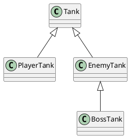
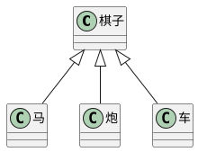

# 类的继承

## 成员的重写

重写(override): 子类中覆盖父类的成员

子类成员不能修改父类成员的类型

无论是属性还是方法，子类都可以对父类的相应成员进行重写，但是重写时，需要保证类型的匹配。

注意this关键字：在继承关系中，this的指向是动态的，调用方法时，根据具体的调用者确定this的指向

super关键字：在子类的方法中，可以使用super关键字读取父类成员

## protected 修饰符

访问权限修饰符：

- readonly: 只读的
- private: 私有的，只能在类的内部访问
- public: 公共的
- protected: 受保护的，只能在自身或子类中访问

## 单根性和传递性

单根性：每个类只能继承一个父类

传递性：如果A是B的父类，且B是C的父类，则可以认为A也是C的父类

# 抽象类

## 为什么需要抽象类

有时，某个类只表示一个抽象概念，主要用于提取子类共有的成员，而不能直接创建他的对象。该类可以作为抽象类。

给类的前面加上关键字 `abstract` ， 表示该类是一个抽象类，不可以直接创建一个抽象类的对象。

## 抽象成员

父类中，可能知道有些成员是必须存在的，但是不知道该成员的值或实现是什么，因此，需要一种强约束，让继承该类的子类必须要实现该成员。

**抽象类中**，可以有抽象成员，这些抽象成员必须在子类中实现，在成员前面加上关键字 `abstract`。

## 设计模式 - 模板模式

设计模式：面对一些常见的功能场景，有一些固定的。经过多年实践的成熟方法，这些方法称之为设计模式。

模板模式：有些方法，所有的子类实现的流程完全一致，只有流程中的某个步骤的具体实现不至于，可以将该方法提取到父类，在父类中完成整个流程的实现，遇到实现不一致的地方时，将该方法做出抽象方法。

# 静态成员

静态成员是指，附着在类上的成员（属于某个构造函数的成员）

使用关键字 `static` 修饰的成员，是静态成员

实例成员：对象成员，属于某个类的对象（类的实例）

静态成员：非对象成员，属于某个类

## 静态方法中的this

实例方法中，this指向当前对象（类的实例）；静态方法中，this指向类

## 设计模式 - 单例模式

单例模式：某些类的对象，在系统中最多只能有一个，为了避免开发者造成随意创建多个类的对象，导致错误，可以使用单例模式进行强约束。

